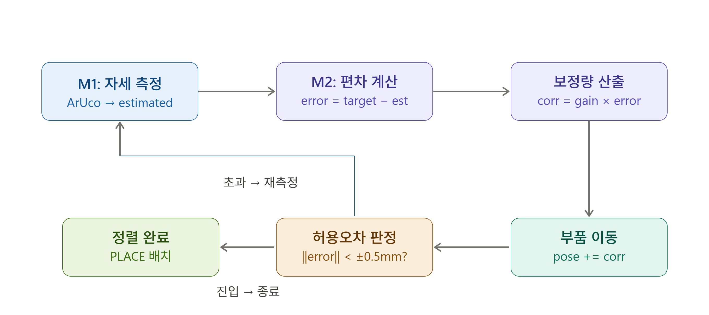
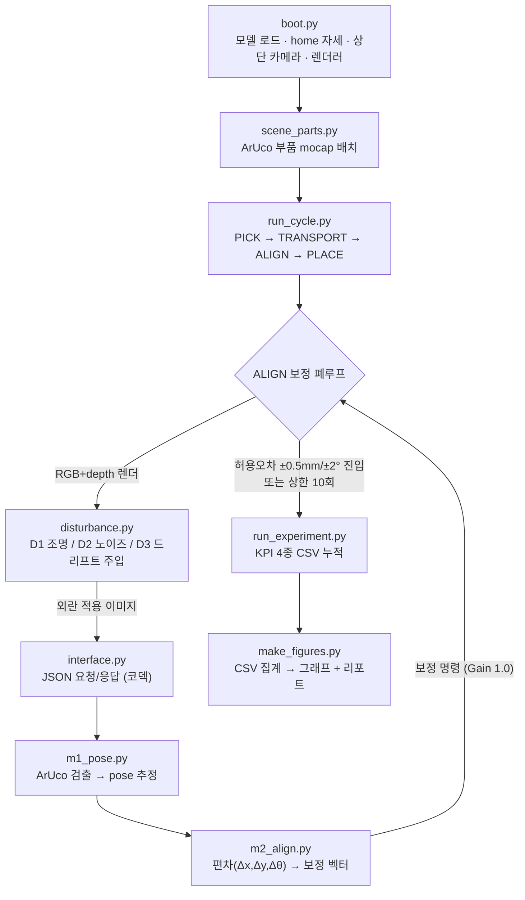

# 비전 보정 루프의 허위 수렴(False-Convergence) 발견과 검증
## — MuJoCo · Franka Panda 기반 광학 부품 정밀 정렬 시뮬레이션

**저자:** 윤태원 | **제출일:** 2026-06-26 | TelePIX SpaceLAB Fellowship — 로봇 시뮬레이션·자동화 트랙

---

## 초록

위성 광학 탑재체의 조립·정렬·검사(AIT) 공정을 로봇으로 자동화하려면, 로봇이 부품을 옮기는 동작뿐 아니라 "지금 얼마나 틀어져 있는가"를 외부 모듈이 스스로 측정하고 보정하는 폐루프가 필요하다. 본 연구는 MuJoCo 시뮬레이터와 Franka Emika Panda 7축 로봇 위에, 카메라 이미지만으로 부품 자세를 추정하고 보정하는 비전 폐루프를 직접 구현하고, 현실에서 자주 발생하는 세 가지 외란(조명, 센서 노이즈, 카메라 좌표 드리프트) 아래에서 신뢰성을 정량 측정했다.

보정 루프는 외란이 없는 기준 조건에서 잔류 오차를 9.84 mm에서 0.38 mm로 약 26배 줄이고 조립 성공률을 0%에서 100%로 끌어올렸다. 그러나 160회 반복 실험에서, 외란이 강해지면 비전이 측정하는 오차는 계속 작아져 "정렬 성공"을 보고하지만 실제 물리 오차는 줄지 않는 **허위 수렴(False-Convergence)** 현상이 드러났다. 특히 카메라 마운트 드리프트(D3) 강한 조건에서 시스템은 "0.30 mm로 정렬 완료"라고 보고하지만 실제로는 평균 11.62 mm 틀어져 있었다 — 자기가 인지하는 오차보다 약 39배 큰 값이다. 같은 패턴은 조명(D1), 노이즈(D2) 조건에서도 공통으로 나타났다. 이 결과는 비전의 자기 측정값만으로 정렬 완료를 판정하는 구조의 위험을 데이터로 보여주며, 측정 기준 좌표의 무결성을 독립적으로 검증하는 이중 지표 또는 재캘리브레이션 장치가 필요함을 시사한다.

**Abstract.** Automating the assembly, integration, and test (AIT) of satellite optical payloads requires not only moving a part into place, but also having an external module measure and correct the remaining misalignment in a closed loop. We implement such a vision-based closed loop on top of the MuJoCo simulator and a Franka Emika Panda 7-DOF robot, estimating and correcting part pose from camera images alone, and quantify its reliability under three realistic disturbances: lighting, sensor noise, and camera-coordinate drift. The correction loop reduces residual error from 9.84 mm to 0.38 mm (about 26×) and raises assembly success from 0% to 100% under an undisturbed baseline. Across 160 trials, however, we observe **False-Convergence**: as disturbances grow stronger the *measured* error keeps shrinking and the system reports "aligned," while the *actual* physical error does not converge. Under strong camera-mount drift (D3), the system reports "aligned at 0.30 mm" while the true error averages 11.62 mm — roughly 39× larger than what it believes. The same pattern appears under lighting (D1) and noise (D2). The results expose the danger of trusting a single self-measured success metric and motivate independent verification of the measurement reference frame.

**키워드:** 비전 기반 정렬, 허위 수렴(False-Convergence), 비례 제어, MuJoCo, Franka Panda, ArUco 마커, Sim-to-Real

---

## 1. 서론

### 1.1 연구 배경과 주제 선정

위성 광학 탑재체는 렌즈·미러 같은 광학 부품이 수십 µm만 어긋나도 광축이 무너지고 초점이 흐트러져 탑재체 전체 성능에 직접 타격을 준다. 그런데 이 조립·정렬·검사 공정의 상당 부분은 아직 숙련 작업자의 수동 조립과 눈으로 보는 검사에 의존하고 있어, 매번 같은 정밀도를 내기 어렵고 검사 결과를 숫자로 남기기도 어렵다. 그래서 로봇팔과 비전을 묶어 이 과정을 자동화하려는 시도가 늘고 있지만, 정작 "자동화된 시스템이 내린 정렬 성공 판정을 믿어도 되는가"라는 질문은 충분히 검증되지 않았다.

본 연구는 바로 이 질문에 답하는 것을 목표로 한다. 카메라로 부품 자세를 추정하고 비례 제어로 오차를 줄이는 정렬 시뮬레이션을 직접 만들고, 세 가지 현실적 외란 아래에서 이 보정 루프가 실제로 믿을 만한 판정을 내리는지 정량적으로 측정했다. 시뮬레이터로 MuJoCo, 로봇으로 Franka Emika Panda를 고른 것은 둘 다 정밀 조작 연구에서 널리 쓰이는 검증된 조합이라 결과를 기존 연구와 견주기 쉽기 때문이다. 무엇보다, 비전 모듈을 시뮬레이터와 별도 프로세스로 떼어 놓았다. 이는 실제 공장에서 로봇 제어 PC와 비전 PC가 다른 기기로 돌아가는 구조를 그대로 본뜬 것으로, 나중에 실물 하드웨어로 옮길 때 비전 쪽을 거의 그대로 재사용할 수 있게 한다.

### 1.2 연구 목표와 기여

목표는 한 문장으로 요약된다 — 외부 비전 모듈이 주도하는 보정 루프가 외란 아래에서도 믿을 만한 정렬 판정을 내리는지를, **비전이 측정한 성공률**과 **실제 성공률(Ground-Truth)**을 나란히 비교해 확인하는 것이다.

기여는 두 가지다. 첫째, 비례 제어 보정 루프가 외란 없는 기준 조건에서 잔류 오차를 약 26배 줄이고 성공률을 0%에서 100%로 끌어올린다는 것을, 160회 반복 실험으로 실증한다. 둘째, 외란이 강해지면 시스템이 내부적으로는 "성공"을 보고하면서 실제 오차는 수렴하지 않는 허위 수렴 현상을 발견하고, 이것이 특정 외란 하나만의 문제가 아니라 세 외란 모두에서 공통으로 나타난다는 것을 데이터로 보인다.

### 1.3 세 가지 외란을 고른 이유

비전 정확도를 떨어뜨리는 요인은 많지만, 광학 부품 조립 환경에서 가장 지배적인 세 가지를 골랐다.

**D1 조명·반사.** 공장 조명의 각도가 바뀌거나 광택이 있는 표면에서 빛이 반사되면, 마커 코너 픽셀에 밝기 치우침이 생겨 ArUco 마커 검출이 흔들린다. 광학 부품은 표면 반사율이 높아 특히 조명에 민감하고, 실제 조립 현장에서도 자주 마주치는 문제다.

**D2 센서 노이즈.** 카메라 센서의 열잡음과 양자 잡음이 픽셀 밝기에 가우시안 백색 노이즈로 얹히면, 마커 패턴의 미세한 특징이 뭉개지고 코너를 정확히 잡기 어려워진다.

**D3 마운트 드리프트.** 카메라를 고정한 볼트가 진동으로 서서히 풀리거나, 장비가 가열되면서 열팽창이 쌓이면 카메라 좌표계의 기준 자체가 조금씩 이동한다. 이 외란이 가장 위험한 이유는, 측정값을 흔드는 게 아니라 **측정의 기준 자체를 오염시키기** 때문이다. 보정 루프가 정상으로 돌아가도 틀어진 기준 위에서 "성공"을 외치게 되는 구조적 약점이 여기서 생긴다.

---

## 2. 이론적 배경

### 2.1 비례 제어 수렴

이 시스템의 정렬은 한 번에 끝나는 오프셋 보정이 아니라, "측정 → 편차 계산 → 보정 → 다시 측정"을 반복하는 피드백 폐루프다. 보정의 핵심은 `m2_align.py`의 다음 두 줄, 비례 제어(Proportional Control)다.

```python
error      = target - estimated   # 목표 자세와 현재 추정 자세의 차이
correction = gain * error         # 차이에 비례하는 보정량 (실험 gain = 1.0)
```

보정량을 현재 자세에 더하면, `gain = 1.0`일 때 이론상으로는 단 한 사이클 만에 correction이 error와 같아져 목표에 완벽히 도달해야 한다. 

그러나 실제 시뮬레이션 궤적(S4 로그)을 보면 한 사이클에 종료되지 않고 보정 사이클이 2~5회 반복된다. 그 이유는 매 사이클 로봇이 물리적으로 이동할 때 발생하는 미세한 오차와, 새롭게 주입되는 검출 노이즈(외란)가 측정값을 흔들기 때문이다. 즉, 잔류 오차를 결정하는 것은 소프트웨어적인 감쇠율이 아니라 물리적 측정 노이즈의 바닥(Noise floor)이다. 시스템은 이 노이즈 바닥 부근에서 허용오차(±0.5 mm)에 진입할 때까지 보정을 반복하게 된다.



### 2.2 ArUco 마커 기반 자세 추정

부품의 평면 자세 $(x, y, \theta)$는 부품 표면에 붙인 ArUco 마커(DICT_4X4_50)로 추정한다. 마커의 코너 4점을 픽셀 좌표로 검출하고, 이를 물리 평면 좌표로 바꿔 중심점 $(x, y)$와 주축 각도 $\theta$를 구한다.

조명(D1)이나 강한 노이즈(D2)로 마커 패턴이 깨졌을 때를 대비해 보조 경로(Contour Backup)를 두었다. OTSU 이진화로 부품 외곽을 분리한 뒤 OpenCV 윤곽선 검출로 외곽 무게중심과 타원 피팅 회전각을 뽑아 자세를 근사한다. 두 방법 모두 실패하면 `DetectionError`를 던지고 해당 시도는 ABORT로 기록한다 — 이렇게 해야 긴 자동 실험이 한 번의 검출 실패로 멈추지 않는다.

### 2.3 픽셀 → 물리 좌표 변환 (런타임 캘리브레이션)

실험 캠페인의 정밀 측정은 1280×960 해상도의 top-down 수직 뷰에서 수행한다(`run_cycle.py`의 `ALIGN_RES = (1280, 960)`, 주석상 "정밀 측정용 고해상도"). 픽셀을 미터 단위로 바꾸기 위해 알려진 세 자세를 mocap으로 옮겨 렌더·검출한 뒤 선형 매핑을 산출한다(`m1_pose.calibrate_scale`).

$$x = (u - u_0)\cdot s, \qquad y = -(v - v_0)\cdot s$$

여기서 scale $s$(픽셀당 실제 거리, 통상 GSD라 부른다)와 원점 $(u_0, v_0)$는 고정 상수가 아니라 **카메라·해상도에 의존하므로 런타임에 계산한다**. D3 드리프트가 위험한 이유가 이 식에서 드러난다 — 이 변환은 카메라 좌표계가 고정되어 있다고 전제하는데, 마운트가 움직이면 $(u_0, v_0)$ 기준 자체가 틀어져 변환식이 오염된다.

---

## 3. 시스템 아키텍처

### 3.1 분리 설계 원칙

전체 시스템은 **로봇 시뮬레이터(`/sim`)**와 **외부 비전 모듈(`/external_module`)**로, 파일 구조와 실행 프로세스 양쪽에서 분리된다. 실제 공장에서 로봇 제어 PC와 비전 처리 PC가 별개 기기로 운용되는 구조를 그대로 본뜬 결정이다.

분리의 실질적 이점은 두 가지다. 첫째, 두 모듈은 오직 JSON 인터페이스로만 통신하므로, 한쪽 내부 구현이 바뀌어도 상대 쪽을 건드릴 필요가 없다. 둘째, 실물로 옮길 때 시뮬레이터의 카메라 렌더 출력을 실제 카메라 API 출력으로 바꾸기만 하면 비전 모듈을 거의 그대로 재사용할 수 있다. 그리고 검증의 독립성도 확보된다 — 비전 모듈이 시뮬레이터 내부 좌표를 들여다볼 수 있다면, 외란으로 측정이 실패해도 내부 값으로 메워 실험이 무의미해진다. 완전히 떼어 놓았기 때문에 "비전 측정만으로 보정이 가능한가"를 정직하게 물을 수 있었다.

### 3.2 프로그램 구조 (Flowchart)



흐름은 다음과 같다. `boot.py`가 MuJoCo 씬과 Franka Panda 모델을 로드하고 렌더러를 띄운다. `scene_parts.py`가 ArUco 마커를 붙인 부품을 씬에 놓으면, `run_cycle.py`가 PICK → TRANSPORT → ALIGN → PLACE 상태 기계를 돌린다. ALIGN 단계에서는 렌더한 이미지에 외란을 주입하고(`disturbance.py`), JSON으로 외부 모듈에 보내(`interface.py`) 자세 추정(M1)과 보정량 산출(M2)을 받아 씬에 반영하는 폐루프를 반복한다. 허용오차에 들거나 최대 반복(10회)에 닿으면 루프를 끝내고, `run_experiment.py`가 KPI를 CSV에 쌓는다. 실험이 끝나면 `make_figures.py`가 CSV를 집계해 그래프 5종과 리포트를 만든다.

### 3.3 JSON 통신 인터페이스

시뮬레이터와 외부 모듈은 파일을 거치지 않고 메모리 안에서 JSON으로 데이터를 주고받는다. 이미지는 base64로 인코딩한 PNG 바이트열로, Depth는 numpy 직렬화로 전달한다. 이렇게 하면 나중에 다른 언어나 다른 장치로 연동을 넓혀도 같은 계약을 유지할 수 있다.

```json
// 시뮬레이터 → 외부 비전 모듈 (Perception Request)
{
  "type": "perception_request",
  "image": "<base64 PNG>",
  "depth": "<base64 npy>",
  "target_pose": { "x": 0.40, "y": 0.45, "theta": 0.0 },
  "cycle": 3
}

// 외부 비전 모듈 → 시뮬레이터 (Perception Response)
{
  "estimated_pose": { "x": 0.41, "y": 0.45, "theta": 0.0 },
  "error":          { "dx": -0.01, "dy": 0.00, "dtheta": 0.0 },
  "correction":     { "dx": -0.01, "dy": 0.00, "dtheta": 0.0 },
  "within_tolerance": false
}
```

(참고: 비전 모듈이 구현되기 전에는 이 JSON 배관이 제대로 도는지 먼저 확인하기 위해, 단순히 수학적으로만 오차를 줄여나가는 더미 인지(Dummy Perception) 로직으로 통신 신뢰성을 독립 검증했다.)

---

## 4. 로봇 모델과 End-Effector

### 4.1 Franka Emika Panda — 사양과 선택 근거

로봇은 Franka Emika Panda 7축 매니퓰레이터를 썼다. MuJoCo Menagerie가 제공하는 공식 MJCF 모델을 수정 없이 동적으로 로드했고, 자유도는 nq = 9(팔 7축 + 그리퍼 손가락 2축), 액추에이터는 nu = 8이다.

고른 이유는 두 가지다. 첫째, Panda는 정밀 조작·조립 연구에서 학계와 산업계가 함께 쓰는 표준 참조 플랫폼이라 결과를 기존 연구와 바로 견줄 수 있다. 둘째, 공식 Menagerie 모델이 있어 커스텀 URDF 없이 검증된 동역학 파라미터를 그대로 쓸 수 있고, 그만큼 모델링 오차가 적다.

### 4.2 그리퍼 제어와 자세 붕괴 방지

그리퍼는 `actuator8`(tendon `split` 제어)로 구동하며 입력 범위는 0~255, **0이 완전 닫힘, 255가 완전 열림**이다. 정렬 완료 판정이 나면 그리퍼를 255로 열어 부품을 씬에 내려놓고 사이클을 끝낸다.

원본 모델에는 카메라가 없어(ncam = 0), 코드에서 elevation = −90°의 top-down 수직 카메라를 동적으로 추가했다. 렌더 해상도는 두 가지를 쓴다 — 개발·검증 단계의 self-test는 640×480으로 빠르게 돌리고, 실제 실험 캠페인은 정밀 측정을 위해 1280×960 오프스크린 렌더러를 쓴다(§2.3). 또 중력 때문에 제어가 없을 때 팔이 처져 관측이 왜곡되는 것을 막기 위해, 매 렌더 직전에 `home` 키프레임의 관절 각도를 강제로 주입해 자세 고정했다.

구현 중에 만난 까다로운 문제 하나는 한글 경로였다. 사용자명에 비ASCII 문자(한글)가 들어 있어 MuJoCo C++ 내부의 `fopen`이 유니코드 경로를 열지 못했고, `cv2.imwrite`도 한글 경로에서 실패했다. 모델은 디렉터리로 `os.chdir` 후 ASCII 파일명만 넘기는 방식으로, 이미지 저장은 `cv2.imencode`로 메모리에 인코딩한 뒤 파이썬 파일 IO로 바이트를 직접 쓰는 방식으로 우회했다.

### 4.3 작업 대상의 추상화

광학 부품은 MuJoCo의 mocap body로 추상화했다. 팔의 실제 관절 궤적을 일일이 제어하는 대신, 부품 자체의 위치·자세를 코드에서 직접 옮기는 방식이다. 이 추상화는 본 연구의 검증 대상이 로봇 운동학이 아니라 **비전 피드백 보정 루프의 신뢰성**이라는 점을 반영한 결정이다. 로봇이 완벽하게 움직인다고 두고, 외란을 비전 측정 계층에만 주입했을 때 보정 루프가 어떻게 반응하는지에 집중할 수 있다. 다만 이 전제 때문에 실제 로봇의 관절 마찰, 모터 편차, 파지 슬립 같은 동역학적 불확실성은 실험 변수에서 빠진다. 이 한계는 §9.3에서 Sim-to-Real 전환의 주요 격차로 다룬다.

---

## 5. 외부 비전 모듈

### 5.1 모듈 선택 근거

외부 비전 모듈은 시뮬레이터로부터 어떤 절대 좌표도 받지 않고, 오직 카메라 이미지만으로 부품 자세를 역계산한다. 실제 하드웨어에서 비전 시스템이 로봇 제어기의 내부 좌표를 직접 참조할 수 없는 조건을 본뜬 것이다.

이렇게 떼어 놓은 핵심 이유는 검증의 독립성이다. 만약 비전이 시뮬레이터 내부 상태를 들여다볼 수 있다면, 외란으로 측정이 실패해도 내부 값으로 보완할 여지가 생겨 실험이 의미를 잃는다. 완전 분리를 통해 "비전 측정만으로 보정이 되는가"를 독립적으로 물을 수 있었다.

### 5.2 자세 추정 모듈 M1 — ArUco + Contour Backup

M1은 이미지에서 부품의 평면 자세 $(x, y, \theta)$를 추정한다. 1차 경로는 ArUco 마커(DICT_4X4_50) 검출이다. 마커 코너 4점의 픽셀 좌표를 잡고 런타임 캘리브레이션(`calibrate_scale`)으로 산출한 선형 매핑을 적용해 물리 좌표로 바꾼 뒤, 4점의 중심에서 부품 중심 $(x, y)$를, 코너 간 벡터 방향에서 회전각 $\theta$를 구한다.

D1·D2로 마커가 손상되면 Contour Backup이 켜진다. OTSU로 이진화한 뒤 OpenCV 윤곽선 검출을 수행하고, 가장 큰 윤곽의 무게중심을 $(x, y)$로, 타원 피팅의 장축 방향을 $\theta$로 근사한다. ArUco보다 정밀도는 낮지만, 마커가 완전히 깨진 상황에서도 검출을 이어가게 해 준다. 두 경로 모두 실패하면 `DetectionError`를 던지고 해당 시도를 ABORT로 기록한다.

### 5.3 편차·보정 모듈 M2

M2는 M1이 낸 `estimated_pose`와 시뮬레이터가 보낸 `target_pose`를 받아 편차와 보정량을 계산하고 JSON으로 돌려준다. 비례 제어의 수렴 원리는 §2.1에서 다뤘고, 여기서 M2가 하는 일은 매 사이클 그 계산을 수행해 결과를 `within_tolerance` 플래그와 함께 시뮬레이터로 반환하는 것이다. 시뮬레이터는 이 값이 `true`면 루프를 끝내고, `false`면 보정량을 부품 자세에 더해 다음 사이클을 시작한다.

허위 수렴은 바로 이 구조에서 싹튼다. **M2의 계산 자체는 늘 정확하다.** 문제는 입력이다 — M1이 오염된 캘리브레이션 기준으로 잰 `estimated_pose`를 넘기면, M2는 "틀어진 자로 잰 오차"만 0으로 수렴시킨다. 측정 오차는 깔끔히 줄어드는데 실제 물리 오차는 그대로 남는 구조적 원인이 여기 있다.

---

## 6. 작업 수행 절차

### 6.1 단일 정렬 사이클 상태 기계

정렬 한 사이클은 다음 순서로 진행된다.

**초기화** — MuJoCo 씬을 로드하고 ArUco 마커를 붙인 부품을 mocap body로 배치하며 카메라와 렌더러를 구성한다. **외란 인가** — 해당 시도의 실험 조건에 따라 D1·D2·D3 중 하나를 적용한다. **영상 캡처** — 1280×960 RGB와 Depth 프레임을 렌더한다. **자세 추정(M1)** — 외부 비전 모듈이 이미지에서 $(x, y, \theta)$를 산출한다. **편차 계산(M2)** — 목표 자세와의 차이를 구하고 보정량을 만든다. **보정 이동** — 보정량을 부품 자세에 더해 씬을 갱신한다. **허용오차 검증** — 다시 찍어 측정 오차가 ±0.5 mm / ±2.0° 안인지 확인한다. 들면 루프를 끝내고 그리퍼를 열어 사이클을 완료하고, 못 들면 최대 10회까지 자세 추정으로 돌아간다. 10회를 넘기거나 `DetectionError`가 나면 ABORT로 전환한다. **로깅** — 측정 잔류 오차, Ground-Truth 오차, 사이클 수, 소요 시간을 CSV에 기록한다.

### 6.2 허용오차 기준을 왜 이렇게 정했는가 (SRS)

허용오차는 데이터가 정해 준 값이 아니라 **내가 설계 단계에서 고른 값**이다(`run_cycle.py`: `SRS_TOL = {"xy": 5e-4, "theta": radians(2.0)}`, 즉 위치 ±0.5 mm / 각도 ±2°).

위치 ±0.5 mm를 고른 근거는 두 가지다. 첫째, 광학 하우징 지그의 기계적 클리어런스를 고려했다 — 이보다 크게 어긋나면 부품과 하우징이 물리적으로 간섭한다. 둘째, 측정 가능성과 균형을 맞췄다. 캘리브된 픽셀 스케일에서 한 픽셀이 차지하는 실제 거리가 약 1 mm 안팎이므로, 그 절반 수준인 ±0.5 mm는 서브픽셀 정밀도 범위에서 비전이 현실적으로 도달할 수 있는 하한이다.

각도 ±2°도 같은 방식으로 정했다. 첫째, 광학 소자 주축 정렬에서 2° 이내면 MTF(modulation transfer function) 저하를 허용 범위로 묶을 수 있다는 경험적 기준을 따랐다. 둘째, 타원 피팅 기반 각도 추정의 실측 정밀도가 ±1~2° 수준이라(검출 노이즈 바닥), 이보다 엄격하면 수렴 자체가 불가능해진다.

### 6.3 파이프라인 단계별 구현 요약

| 단계 | 목표 | 핵심 구현 | 통과 조건 |
|---|---|---|---|
| S1 Boot | MuJoCo 씬 로드, 카메라 렌더 | Menagerie MJCF 로드, home 키프레임 주입, top-down 렌더러 | RGB+Depth 저장, 로봇 가시 확인 |
| S2 Interface | JSON 통신 배관 | base64 이미지 코덱, 더미 인지로 배관 독립 검증 | 이미지 전송 → 좌표 수신 1회 성공 |
| S3 Vision | M1 자세 추정, M2 보정 벡터 | ArUco + Contour Backup, GSD 캘리브, 비례 제어 | 부품 위치·각도 수치 출력 |
| S4 Loop | 보정 폐루프 연동 | run_cycle.py 상태 기계, **gain=1.0 반복 보정** | 보정 전후 오차 감소 확인 |
| S5 Disturbance | 외란 3종 주입 | D1 광원 조작, D2 가우시안 노이즈, D3 카메라 이동 | 외란 ON 시 이미지·좌표 실제 변화 |
| S6 Campaign | 160 trial 자동 실험 | 외란 3 × 강도 4 × 보정 2 × 8회 스윕, CSV 누적, ABORT 처리 | KPI 4종 CSV 정상 누적 |
| S7 Analysis | CSV 집계, 그래프 5종 | make_figures.py, matplotlib + seaborn | 5개 그래프 생성, 수치 CSV 일치 |

---

## 7. 실험 설계

### 7.1 실험 목적

실험은 두 가지를 본다. 첫째, 비전 보정 루프가 외란 없는 기준 조건에서 오차를 얼마나 줄이는지 정량화한다. 둘째, 외란의 종류와 강도가 세질 때 어느 지점에서 비전 측정이 실패하거나 허위 수렴이 발생하는지 짚어낸다.

### 7.2 실험 요인 설계

실험은 완전 교차 격자(Full-Factorial Grid) 설계를 따른다. 단, 외란끼리 섞여 오염되는 것을 막기 위해 한 번에 외란 하나만 켠다.

**기준 조건 (channel = none).** 모든 외란을 끈 조건. 비례 보정이 외란 없이 수렴하는지 확인하는 기준선이며, 보정 ON/OFF 2조건으로 운영한다.
**외란 조건 (channel = d1 / d2 / d3).** 각 외란 채널마다 강도를 weak / med / strong 세 수준으로 두고, 각 조합에 보정 ON/OFF를 교차해 조건당 2행을 만든다.

전체 조건 수는 $1\times2 + 3\times3\times2 = 20$개. 조건당 8회 반복해 총 $20\times8 = 160$ trial이다.

### 7.3 종속 변수 (KPI 4종)

각 trial마다 CSV에 남기는 종속 변수는 다음과 같다.

**측정 잔류 오차 (residual_pos_mm)** — 보정 루프가 끝난 뒤 비전이 잰 위치 오차. 시스템이 "정렬 끝났다"고 판단하는 근거다.
**Ground-Truth 오차 (gt_residual_pos_mm)** — 시뮬레이터 내부 좌표 기준의 실제 물리 오차. 이 값과 측정 오차의 어긋남이 곧 허위 수렴의 정량적 척도다.
**측정 성공률 (success)** — 측정 잔류 오차가 ±0.5 mm / ±2.0° 안인 trial의 비율.
**실제 성공률 (success_gt)** — Ground-Truth 오차가 ±0.5 mm / ±2.0° 안인 trial의 비율. 시스템이 실제로 목표 정밀도에 닿았는지를 보여주는 최종 지표다.

---

## 8. 결과 및 분석

### 8.1 기준 조건 성능

외란 없는 기준 조건(channel = none)에서 보정 루프의 효과를 비교한다.

보정 OFF에서는 8 trial 모두 측정 잔류 오차 9.836 mm, Ground-Truth 오차 10.000 mm로 허용오차(±0.5 mm)를 크게 넘겨 측정·실제 성공률 모두 0%였다. 보정 ON에서는 측정 잔류 오차 0.381 mm, GT 오차 0.173 mm로 수렴해 두 성공률 모두 100%였다. 외부 비전 보정이 없으면 누적 기계 오차로 1 cm 가까이 벌어지지만, 보정을 켜는 것만으로 그 오차가 흡수된다.


### 8.2 외란별 성공률 비교

아래 표는 외란 채널·강도·보정 여부별로 측정 성공률(S_meas)과 실제 성공률(S_gt)을 정리한 것이다(보정 ON 기준).

| 외란 | 강도 | 측정 잔류 | S_meas | GT 잔류 | S_gt |
|---|---|---|---|---|---|
| D1 | weak | 0.381 mm | 100% | 0.607 mm | 0% |
| D1 | med | 0.381 mm | 100% | 0.607 mm | 0% |
| D1 | strong | 0.381 mm | 100% | 0.607 mm | 0% |
| D2 | weak | 0.381 mm | 100% | 0.173 mm | 100% |
| D2 | med | 0.348 mm | 100% | 0.180 mm | 100% |
| D2 | strong | 0.501 mm | 75% | 0.489 mm | 37.5% |
| D3 | weak | 0.296 mm | 100% | 1.803 mm | 12.5% |
| D3 | med | 0.341 mm | 100% | 5.688 mm | 12.5% |
| D3 | strong | 0.296 mm | 100% | 11.623 mm | 12.5% |

D1은 강도와 무관하게 보정 ON 시 S_meas = 100%이지만 S_gt = 0%로 일관된다. D2는 weak·med에서 완전히 성공하고 strong에서만 부분 실패한다. D3는 모든 강도에서 S_meas = 100%이면서 S_gt = 12.5%에 묶이는 특이한 패턴을 보인다.


### 8.3 허위 수렴(False-Convergence) 정량화

허위 수렴은 비전이 정렬 성공을 보고하는 동시에 실제 물리 오차가 허용 범위를 벗어난 상태로 정의한다. 위 표에서 S_meas > S_gt인 조건이 모두 여기 해당한다.

**D3 strong의 극단적 사례.** 평균으로 보면 측정 0.296 mm 대 GT 11.623 mm, 비율은 **약 39배**다. 메커니즘은 코드에서 분명하다 — D3는 카메라 `lookat`을 사이클에 비례해 옮긴다. 보정 루프가 수렴하는 데 걸린 사이클 수가 trial마다 다르므로 누적 드리프트도 trial마다 달라진다. 비전 모듈은 이 드리프트를 감지하지 못한 채 오염된 기준으로 잰 "0에 가까운 오차"를 보고한다. 

**D1의 구조적 허위 수렴.** 조명·글레어는 측정 기준을 0.607 mm 수준으로 일정하게 오프셋시킨다. 이 값이 허용오차(±0.5 mm)를 살짝 넘겨 S_gt = 0%가 되지만, 측정 오차는 늘 ±0.5 mm 안으로 수렴한다. 작지만 체계적인 허위 수렴이다.

**D2 strong의 임계 허위 수렴.** GT 오차 분포가 0.173~0.725 mm에 퍼져 S_gt = 37.5%다. 허용오차 경계 부근에서 성공과 실패가 섞이는 임계 영역에 해당한다.


### 8.4 외란 내성 서열

세 외란의 영향을 S_gt 기준으로 정리하면 이렇다.

**D2(센서 노이즈)**는 weak·med에서 완전히 성공하고 strong에서만 부분 실패한다. 
**D1(조명)**은 강도와 무관하게 측정 기준을 일정 오프셋으로 오염시켜 모든 수준에서 허위 수렴을 부른다. 
**D3(마운트 드리프트)**는 강도가 오를수록 GT 오차 평균이 가파르게 악화되는 반면, 측정 오차는 강도와 무관하게 ±0.5 mm 안으로 수렴한다. 세 외란 중 D3가 가장 치명적이다.


---

## 9. 한계 및 향후 연구

### 9.1 비전 시스템의 구조적 한계

지금 구현은 2D 평면 자세 $(x, y, \theta)$만 추정한다. 실제 광학 탑재체 AIT 공정에서는 광축 방향 평행 이동(Z축)과 피치·롤 회전까지 포함한 6-DOF 정렬이 필요하다. 

### 9.2 실험 설계의 한계

실험은 외란을 한 번에 하나씩 거는 단일 요인 설계를 따랐다. 실제 현장에서 발생하는 복합 외란에서 허위 수렴 빈도와 외란 간 상호작용을 재는 실험은 향후 과제다. 

### 9.3 Sim-to-Real 전환 격차

§4.3에서 부품을 mocap body로 추상화한 결과, 실제 Franka Panda 하드웨어에서 생기는 관절 마찰·모터 전류 분산·엔드이펙터 진동이 현재 시뮬레이션에 빠져 있다. 이런 오차 원인이 쌓이면 실제 정밀도는 시뮬레이션 수치보다 낮아진다. 따라서 §8의 성공률과 잔류 오차는 실제 하드웨어에서의 상한으로 읽어야 한다.

### 9.4 향후 연구 방향

첫째, D3 대응이다. 씬에 고정 참조 마커를 추가해 카메라 좌표계 자체의 드리프트를 실시간으로 추정·보정하는 자동 재캘리브레이션을 넣으면, 허위 수렴의 근본 원인인 기준 오염을 사전에 차단할 수 있다. 둘째, D1·D2·D3를 동시에 거는 복합 외란 실험으로 현실에 더 가까운 조건에서 신뢰도를 측정한다. 

---

## 10. 결론

본 연구는 MuJoCo 기반 Franka Panda 시뮬레이션에서 비전 피드백 보정 루프의 신뢰성을 검증했다. 160회 반복 실험에서 두 가지를 얻었다.

첫째, 비례 제어 보정 루프는 조립 성공률을 0%에서 100%로 올리며, 광학 부품 정밀 정렬 자동화에 실효가 있음을 뒷받침한다.
둘째, 세 가지 현실적 외란 모두에서 허위 수렴이 공통으로 나타난다. 측정 성공률만을 신뢰도 지표로 쓰면 치명적인 오정렬을 "정렬 완료"로 오판할 수 있다.

실용적 함의는 분명하다. 비전 기반 폐루프 정렬 시스템은, 측정 기준 자체의 무결성을 독립적으로 검증하는 이중 지표 구조를 갖추거나, 외부 캘리브레이션 참조 없이는 드리프트를 감지할 수 없는 구조적 약점을 메우는 재캘리브레이션 장치를 갖추어야 한다.

---

## 부록 A. 실험 전체 조건별 결과 요약

총 160 trial, 20 조건 × 8 반복. 모든 수치는 8회 평균이다.

| 외란 채널 | 강도 | 보정 | n | 측정 잔류 (mm) | 측정 성공률 | GT 잔류 (mm) | 실제 성공률 |
|---|---|---|---|---|---|---|---|
| none (기준) | — | OFF | 8 | 9.836 | 0.0% | 10.000 | 0.0% |
| none (기준) | — | ON | 8 | 0.381 | 100.0% | 0.173 | 100.0% |
| D1 | weak | OFF | 8 | 9.836 | 0.0% | 10.000 | 0.0% |
| D1 | weak | ON | 8 | 0.381 | 100.0% | 0.607 | **0.0%** |
| D1 | med | OFF | 8 | 9.836 | 0.0% | 10.000 | 0.0% |
| D1 | med | ON | 8 | 0.381 | 100.0% | 0.607 | **0.0%** |
| D1 | strong | OFF | 8 | 9.836 | 0.0% | 10.000 | 0.0% |
| D1 | strong | ON | 8 | 0.381 | 100.0% | 0.607 | **0.0%** |
| D2 | weak | OFF | 8 | 9.836 | 0.0% | 10.000 | 0.0% |
| D2 | weak | ON | 8 | 0.381 | 100.0% | 0.173 | 100.0% |
| D2 | med | OFF | 8 | 9.836 | 0.0% | 10.000 | 0.0% |
| D2 | med | ON | 8 | 0.348 | 100.0% | 0.180 | 100.0% |
| D2 | strong | OFF | 8 | 9.836 | 0.0% | 10.000 | 0.0% |
| D2 | strong | ON | 8 | 0.501 | 75.0% | 0.489 | **37.5%** |
| D3 | weak | OFF | 8 | 9.115 | 0.0% | 10.000 | 0.0% |
| D3 | weak | ON | 8 | 0.296 | 100.0% | 1.803 | **12.5%** |
| D3 | med | OFF | 8 | 9.366 | 0.0% | 10.000 | 0.0% |
| D3 | med | ON | 8 | 0.341 | 100.0% | 5.688 | **12.5%** |
| D3 | strong | OFF | 8 | 12.850 | 0.0% | 10.000 | 0.0% |
| D3 | strong | ON | 8 | 0.296 | 100.0% | 11.623 | **12.5%** |

굵은 수치는 허위 수렴 발생 조건(S_meas > S_gt)이다.

---

## 부록 B. 외란 모델 파라미터 및 통신 규약

### B.1 외란 모델 파라미터 (코드 출처)

세 외란의 강도 수치는 `sim/disturbance.py`의 `LEVELS` 딕셔너리에 고정해 재현성을 확보했다. 적용 순서는 D3(카메라 이동) → D1(조명·글레어) → D2(노이즈)다.

| 외란 | 파라미터 | off | weak | med | strong |
|---|---|---|---|---|---|
| D1 조명 | headlight diffuse/ambient 배율 | 1.0 | 1.3 | 1.7 | 2.2 |
| D1 글레어 | 반사 spot 강도 | 0.0 | 0.15 | 0.30 | 0.5 |
| D2 노이즈 | 가우시안 σ (uint8) | 0 | 5 | 15 | 30 |
| D3 드리프트 | 카메라 lookat 오프셋 (m/cycle, y축 ×0.5) | 0 | 5e-4 | 1.5e-3 | 3e-3 |

D3는 다른 둘과 성격이 다르다. D1·D2는 이미지 픽셀을 흔들 뿐 캘리브레이션 기준은 건드리지 않는 반면, D3는 카메라 외부 파라미터(`lookat`) 자체를 사이클에 비례해 이동시켜 고정 캘리브 기준 대비 측정 bias를 만든다. 이것이 D3가 허위 수렴을 일으키는 근본 원인이다.

### B.2 JSON 인터페이스 계약

**요청 (Simulator → Vision Module):**
```json
{
  "type": "perception_request",
  "image": "<base64 PNG>",
  "depth": "<base64 npy>",
  "target_pose": {"x": 0.0, "y": 0.0, "theta": 0.0},
  "cycle": 0
}
```

**응답 (Vision Module → Simulator):**
```json
{
  "estimated_pose": {"x": 0.0, "y": 0.0, "theta": 0.0},
  "error": {"dx": 0.0, "dy": 0.0, "dtheta": 0.0},
  "correction": {"dx": 0.0, "dy": 0.0, "dtheta": 0.0},
  "within_tolerance": false
}
```
