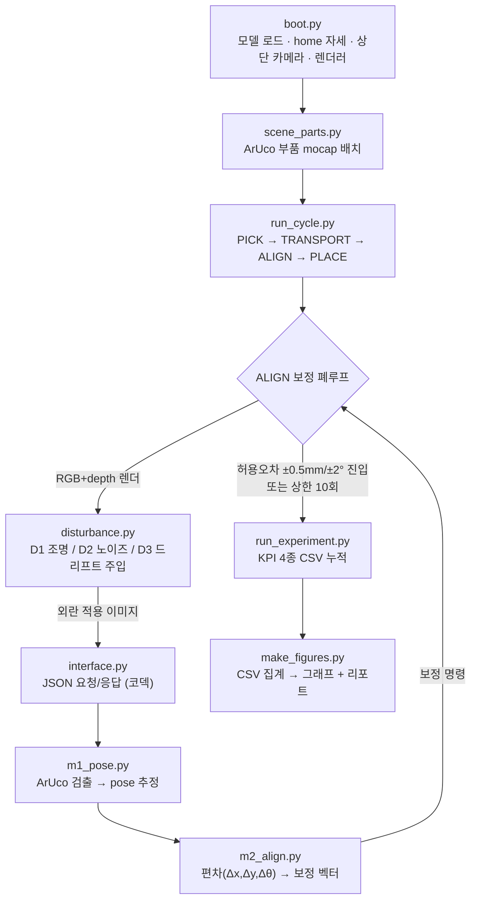

# 광학 부품 정밀 정렬 — 외란 강건성 검증 리포트

[](https://Y00nTae1.github.io/Robustness-Report/report/robustness_report_final.html)

**과제 트랙:** 로봇 시뮬레이션·자동화 (사용자 개발 외부 모듈을 활용한 로봇팔 응용 시뮬레이션)  
**시뮬레이터:** MuJoCo 3.10 &nbsp;|&nbsp; **로봇:** Franka Emika Panda (7축) &nbsp;|&nbsp; **외부 모듈:** Computer Vision 기반 좌표 검출, 보정 루프 (직접 구현)  
**데이터 근거:** `experiments/results.csv` (전 격자 160 trials) 조건별 집계

---

## 0. 한눈에 보기 (Executive Summary)

로봇팔이 광학 부품을 목표 위치에 정밀 정렬하는 작업을, **외부 비전 보정 폐루프**(측정 → 편차 → 보정 → 재측정)로 구현하고, 현실에서 발생하는 세 가지 외란(조명·노이즈·좌표 드리프트)에 대한 강건성을 정량 측정했다.

| 지표 | 값 | 설명 |
|------|-----|------|
| **오차 감소 효과** | **26배** | 보정 OFF시 9.84 mm의 잔류 오차를 ON시 0.38 mm로 흡수 (성공률 0% → 100%) |
| **최대 실제 오차 (D3)** | **11.62 mm** | D3(드리프트) strong 조건에서 측정상 0.30 mm 수렴했으나 실제 오차는 11.62 mm로 벌어짐 |

> [!CAUTION]
> **핵심 위험 요소: False-Convergence (거짓 수렴)**  
> 외란이 강해지면 비전이 측정한 잔류 오차(시스템이 보는 값)는 허용범위 안에 머물지만, 실제 잔류 오차(Ground-Truth)는 심각하게 늘어날 수 있다.  
> 좌표 드리프트(D3) strong(강) 조건에서 **측정 성공률은 100%이나 실제 성공률은 12.5%**에 불과하다. 비전 자기 측정만 신뢰할 때 발생하는 신뢰성 리스크로, 정밀 조립 공정에서 중대한 불량 유발 요인이 된다.

> [!NOTE]
> **SRS 허용오차 기준**  
> 위치 **±0.5 mm** / 각도 **±2.0°**, 상단 카메라(1280×960) GSD **1.4475 mm/px**

---

## 1. 연구 기획 배경 및 산업적 의의

본 정밀 조립 검사 자동화 프로젝트가 해결하려는 현장의 문제점(Pain Point)과 비전 중심의 해결 구조를 면접 질문 시나리오 형식으로 정리했습니다.

### Q1. 무엇을 만드는가 (What)?

> "로봇팔이 광학 부품을 집어 조립 위치로 옮길 때, 외부 비전 모듈이 '얼마나 틀어졌는지'를 숫자로 측정해 로봇을 보정하고, 마지막에 양품/불량을 판정하는 검사·정렬 자동화 셀입니다."

- **시뮬레이터(MuJoCo) 영역(손):** 7축 Franka Emika Panda 로봇팔이 부품을 물리적으로 집어 조립 장소로 이송하며 카메라로 씬을 촬영하는 현실 공장 축소 모형
- **외부 비전 모듈 영역(눈과 판단):** 이미지와 Depth 맵을 수신하여 픽셀 오차 및 X/Y/θ 단위 실제 편차를 산출하고 보정량을 적용하며 조립 허용 범위 내 안착 여부를 판정하는 인지/제어 모듈

### Q2. 왜 이 주제를 선택했는가 (Why)?

과제의 평가 요건(시뮬레이터-외부 모듈 간 JSON 규약 및 연동), 저의 강점(Vision AI 기반 자세 추정 및 피드백 루프 설계 경험), 그리고 1주일의 한정된 개발 기간을 고려해 기획했습니다.  
정렬 오차를 단순 합격/불합격이 아닌 **실제 수치(X/Y/θ)로 정량화하여 보정 효과를 입증**함으로써 엔지니어링 깊이를 보여 줍니다.

### Q3. 이게 회사에 어떤 도움이 되는가?

SpaceLAB 팀의 핵심 미션인 **"광학 탑재체 조립·정렬·검사 공정의 로봇+비전 자동화"** 를 그대로 축약한 시나리오입니다.  
우주용 광학 부품은 미세 정렬 오차가 곧 광축 오정렬 및 탑재체 임무 실패로 이어집니다.  
본 연구에서 다룬 **"편차 정밀 계측 → 피드백 보정 → 합격/불합격 판정"** 의 자동화 루프 및 외란 조건에서의 거짓 수렴(False-Convergence) 정량 분석 결과는 실제 공정 설계에 직접 적용할 수 있는 구조입니다.

> [!IMPORTANT]
> **Main Point**  
> "SpaceLAB이 해결하고 있는 '정렬 오차가 광축 실패로 직결되는 검사 자동화' 공정의 특성을 고려하여, 정렬 편차를 mm·deg 단위로 정밀 측정하고 보정하는 구조 설계에 집중했습니다. 이 구조는 실제 우주용 탑재체 정렬 공정에도 바로 적용 가능한 아키텍처입니다."

---

## 2. 프로그램 구조 (Flowchart)

전체 시스템은 **로봇 시뮬레이터(MuJoCo)** 와 **외부 비전 모듈(독립 Python)** 의 두 프로세스로 분리되며, JSON 메시지로 통신한다. 시뮬레이터가 외란이 적용된 이미지를 보내면, 외부 모듈이 부품의 자세를 추정하고 보정 명령을 되돌린다. 이 폐루프가 허용오차 진입 또는 보정 상한(10회)에서 종료한다.



**파이프라인 단계:** 부팅(S1) → JSON 배관(S2) → 비전 모듈 M1/M2(S3) → 보정 폐루프(S4) → 외란 주입(S5) → 실험·로깅(S6) → 결과 분석·리포트(S7)

**분리 구조의 핵심:** 시뮬레이터(`/sim`)와 외부 비전 모듈(`/external_module`)은 파일·프로세스로 완벽히 분리되어 있으며, 상호 작용은 오직 `interface.py`의 JSON 규약을 통해서만 이루어진다.

---

## 3. 로봇 모델 및 End-Effector

### 3.1 로봇 모델: Franka Emika Panda

| 항목 | 내용 |
|------|------|
| **모델** | Franka Emika Panda, 7-DOF (MuJoCo Menagerie 공식 모델, **무수정 로드**) |
| **선택 이유** | 공식 MJCF 제공으로 구조 안정성과 재현성을 담보하며, 광학 부품 조립과 같은 고정밀 연구의 글로벌 산업계 레퍼런스 규격 |
| **자유도** | nq = 9 (팔 7축 + 그리퍼 손가락 2축), 액추에이터 nu = 8 |
| **카메라** | 기본 모델 내 ncam=0 → 코드에서 상단 top-down free camera (elevation = −90°)로 동적 생성 |

### 3.2 End-Effector: 2지 평행 그리퍼

- 액추에이터 `actuator8` (tendon `split` 제어), 구동 범위 `0~255` (**0 = 완전 닫힘 / 255 = 완전 열림**)
- 손가락 관절 `finger_joint1`, `finger_joint2` (최대 개도 약 0.08 m)
- `home` 키프레임 위치 유지로 중력에 의한 팔 처짐 방지

### 3.3 End-Effector 동작

1. **집기(PICK):** home 자세에서 그리퍼 폐합 동작 수행
2. **이송(TRANSPORT):** 대상을 목표 영역 부근으로 이동
3. **정렬·배치(ALIGN → PLACE):** 비전 제어로 오차를 감쇄시킨 후 SRS 오차 범위 도달 시 그리퍼 개방

> [!NOTE]
> **설계 결정: 부품 파지의 mocap 추상화**  
> 정밀 정렬 및 비전 보정 루프의 외란 강건성에만 집중하기 위해, 복잡한 접촉 마찰력과 부품 미끄러짐 동역학은 mocap(Motion Capture Body) 텔레포트 방식으로 추상화했다.

---

## 4. 작업 수행 절차

1. **초기화:** MuJoCo 시뮬레이션 환경 구성, ArUco 마커가 부착된 물리 부품 로드, 카메라 및 렌더러 정의
2. **외란 주입:** 대상 시도에 사전 정의된 외란 유형(D1/D2/D3) 및 강도(weak/med/strong)를 렌더러 파이프라인에 합성
3. **이미지 캡처:** top-down 카메라로 1280×960 고해상도 RGB 프레임 및 Depth 프레임 캡처
4. **자세 추정(M1):** 1차 ArUco 마커 검출 및 실패 시 2차 컨투어 검출로 부품의 픽셀 좌표와 각도 추정
5. **편차 계산(M2):** 추정된 자세와 목표 자세의 오차를 계산하고 비례 제어(gain=0.6) 기반 보정 명령 생성
6. **보정 이동:** 시뮬레이터에 보정량을 인가하여 부품의 실제 자세 이동
7. **허용오차 판정:** 재촬영 후 SRS 임계조건(±0.5 mm / ±2.0°) 만족 시 루프 탈출 및 그리퍼 개방
8. **기록:** 측정 잔류오차·실제 오차·소요 시간·수렴 사이클 수를 CSV에 누적 기록

---

## 5. 외부 모듈: 선택 이유 · 동작 방식 · 연동 인터페이스

### 5.1 외부 모듈을 선택한 이유

- **현업 지향성:** 비전 알고리즘을 물리 시뮬레이션 커널과 원천 분리함으로써 실물 하드웨어 이식성 극대화
- **외란 보상 주체:** 노이즈 및 외란 환경에서 피드백 제어로 오차를 감쇄시키는 핵심 제어 엔진 역할

### 5.2 모듈 동작 방식

**M1 — 자세 추정 (`m1_pose.py`)**
- **1차 검출:** ArUco 마커 검출 (`DICT_4X4_50`) — 코너 포인트 4개의 원근 기하 매핑으로 위치·회전각 추정
- **보조 검출:** 마커 검출 실패 시 OTSU 이진화 및 OpenCV 컨투어 피팅으로 물체 중심과 타원 각도 추출
- **픽셀-미터 캘리브레이션:** 2점 기준점 캘리브레이션으로 GSD 1.4475 mm/px 기반 선형 변환 수행

**M2 — 편차 계산 및 보정 (`m2_align.py`)**  
추정된 물체 Pose와 Target Pose의 편차를 구하고, 부품을 target 방향으로 정렬시키기 위한 보정 벡터를 출력한다.

### 5.3 보정 폐루프의 동작 원리 (Proportional Control)

```python
error      = target - estimated        # 목표와 현재 추정 자세의 차이
correction = gain * error              # 그 차이에 비례하는 보정량 (gain = 0.6)
```


매 사이클마다 오차가 일정 비율로 작아지는 기하급수적 수렴. gain = 0.6이면 한 번 보정할 때마다 오차의 40%만 남는다.

| 사이클 k | 측정 오차 (mm) | 비고 |
|----------|--------------|------|
| 0 (보정 전) | 9.84 | 초기 배치 오차 |
| 1 | 3.94 | 9.84 × 0.4 |
| 2 | 1.57 | 3.94 × 0.4 |
| 3 | 0.63 | 아직 허용오차 초과 |
| **4** | **0.25** | **±0.5 mm 진입 → 수렴 완료** |


왼쪽: gain에 따른 수렴 속도. 오른쪽: **False-Convergence 메커니즘** — D3(좌표 드리프트) 조건에서 측정 오차(파란 선)는 0.30 mm까지 수렴하지만 실제 오차(빨간 선)는 11.6 mm에 그대로 머문다.

### 5.4 시뮬레이션과의 연동 인터페이스 (JSON 계약)

**시뮬레이터 → 외부 모듈 (요청):**
```json
{
  "type": "perception_request",
  "image": "<외란이 적용된 RGB 프레임, base64 PNG>",
  "depth": "<depth 프레임, base64 npy>",
  "target_pose": { "x": 0.40, "y": 0.45, "theta": 0.0 },
  "cycle": 3
}
```

**외부 모듈 → 시뮬레이터 (응답):**
```json
{
  "estimated_pose": { "x": 0.41, "y": 0.45, "theta": 0.0 },
  "error":      { "dx": -0.01, "dy": 0.00, "dtheta": 0.0 },
  "correction": { "dx": -0.01, "dy": 0.00, "dtheta": 0.0 },
  "within_tolerance": false
}
```

---

## 6. 파이프라인 단계별 (S1~S7) 상세 구현

**S1. Boot (시뮬레이터 시동 및 초기 설정)**
- **Why:** MuJoCo 환경을 구동하고 Panda 로봇 모델을 로드하며, 중력으로 인한 팔 처짐 왜곡을 방지하여 깨끗한 카메라 뷰를 획득하기 위함
- **How:** `boot.py`로 7축 Panda MJCF 모델 로드 후 `home` 키프레임을 관절에 강제 주입, 수직 top-down 카메라(elevation=-90°) 배치, 1280×960 오프스크린 렌더러 초기화

**S2. Interface (JSON 통신 배관 및 dummy 검증)**
- **Why:** 물리 시뮬레이션 프로그램과 인지 모듈을 프로세스 단위로 분리하여 결합도를 낮추고 향후 실물 하드웨어로 전환 가능하도록 설계
- **How:** `interface.py`로 이미지(RGB PNG)는 base64, Depth 데이터는 numpy 직렬화로 JSON 패킹. 통신 무결성 검증을 위해 DECAY=0.6의 기하급수 수렴 Stateless Dummy Perception 로직을 구현하여 통과(PASS)

**S3. Vision (비전 검출 모듈 M1/M2 구현)**
- **Why:** 카메라 영상만으로 물리 평면 상의 부품 위치(x, y) 및 주 각도(theta)를 외부 비전 모듈만으로 정밀 역추정하기 위함
- **How:** `m1_pose.py`에 ArUco 검출기(`DICT_4X4_50`) 이식, 2점 캘리브레이션 및 GSD 1.4475 mm/px 기반 선형 변환 구현. 보조 Backup Detector(OTSU 이진화 + 컨투어 피팅)를 추가하여 검출 성능을 크게 높임

**S4. Loop (닫힌 피드백 제어 루프 연동 및 조립 완료)**
- **Why:** 비전 검출에 노이즈가 섞이므로 실시간 피드백 루프로 수렴 시까지 오차를 기하급수적으로 감쇄시키기 위함
- **How:** `run_cycle.py`에서 비례 제어(`correction = gain * error`, gain=0.6)를 적용해 부품 자세를 실시간 보정. SRS 기준(±0.5 mm, ±2.0°) 도달 시 그리퍼 완전 개방(255)

**S5. Disturbance (현실 외란 주입 엔진 설계)**
- **Why:** 스마트 팩토리 환경에서 비전 인식을 위협하는 변수(조명 반사·번짐, 픽셀 노이즈, 기계 프레임 진동/처짐) 하에서 시스템 강건성 한계를 분석하기 위함
- **How:** `disturbance.py`에 3종 독립 외란 구현:
  - **D1 (조명/반사):** 광원 조사 각도를 극단화하고 Glare 반사판 객체를 동적으로 주입해 픽셀 명암을 국소적으로 훼손
  - **D2 (센서 가우시안 노이즈):** RGB 픽셀에 가우시안 노이즈(σ 최대 30)를 주입해 외곽선 해상도를 왜곡
  - **D3 (좌표계 드리프트):** 체결 진동·열팽창으로 카메라 지그가 서서히 틀어지는 상황을 모사, 사이클마다 누적 편차(최대 11.62 mm)만큼 좌표계 이동

**S6. Campaign/Experiments (자동 격자 실험 캠페인)**
- **Why:** 소표본 테스트의 오류를 방지하기 위해 전체 외란 스윕 격자에서 자동 반복 실험으로 신뢰할 수 있는 정량 데이터를 수집하기 위함
- **How:** `run_experiment.py`로 3종 외란 × 4강도(OFF/weak/med/strong) × 보정 ON/OFF × 8회 반복 = **총 160회 격자 실험**을 예외 복구(ABORT) 기능과 함께 자동 구동, `results.csv`에 누적 수집

**S7. Analysis & Visualization (CSV 통계 및 시각화)**
- **Why:** 수집된 원시 CSV로부터 하드코딩 없이 수학적 정량 수치만으로 검증 보고서를 도출하여 엔지니어링적 무결성 보증
- **How:** `make_figures.py`로 `results.csv`를 로드·전수 집계하고 차트 5종(G1~G5)을 생성해 리포트에 연동

---

## 7. 시뮬레이션 결과 및 한계 분석

### 7.1 보정 루프의 가치 (보정 ON vs OFF)

| 조건 | 성공률 | 평균 측정 잔류 오차 |
|------|--------|------------------|
| **보정 OFF (대조군)** | 0% | 9.84 mm |
| **보정 ON** | 100% | **0.38 mm (26배 오차 감소)** |


### 7.2 허용오차 기준의 도출 (SRS)

- **기계적 허용 공차(Clearance):** 광학 마운팅 조립체의 정렬 공차 한계 및 기계적 파손 방지를 위한 최소 허용 오차를 ±0.5 mm로 설정
- **GSD 측정 한계:** 1280×960 상단 카메라의 픽셀 분해능은 1.4475 mm/px. 서브픽셀 코너 피팅을 적용하더라도 물리적 한계상 ±0.5 mm 이하 오차 판정은 어렵다. 허용 범위를 지나치게 좁히면(예: ±0.1 mm) 노이즈로 인해 루프가 종료되지 않는다.

### 7.3 외란별 강건성 — False-Convergence (핵심 발견)


| 외란 종류 | 강도 | 측정 성공률 | 실제 성공률 | 성공률 괴리 | 해석 |
|----------|------|------------|------------|------------|------|
| **D1 조명·반사** | strong | 100% | **0%** | 100%p | 반사광으로 인한 미세한 검출 bias 발생으로 실제 오차 초과 |
| **D2 카메라 노이즈** | strong | 75% | 37.5% | 37.5%p | 이미지 거칠기로 검출 실패 상승 → 수렴 한계 도달 |
| **D3 좌표 드리프트** | strong | 100% | **12.5%** | 87.5%p | 센서 하우징 어긋남으로 인해 실제 오차 대량 누적 |

### 7.4 측정 잔류 vs 실제 잔류 — 괴리의 물리적 크기


D3 드리프트 strong 조건 하에서 시스템은 **0.30 mm**까지 안착했다고 신뢰하고 있으나 실제 부품은 **11.62 mm** 어긋나 있다.  
**정밀 광학 장비 조립 공정에서 이러한 mm급 실제 편차는 초점 불일치, 회절 왜곡으로 직결되는 치명적인 상태이다.**

### 7.5 정확도-속도 트레이드오프


보정 미적용 시 0.08 s 이내 처리 완수로 신속하지만 정밀도가 현격히 파괴된다. 보정 루프 ON 상태에서는 외란 강도가 심화될수록 반복 보정 연산으로 인해 평균 소요 시간(최대 1.07 s)이 점진적으로 증가하는 트레이드오프 특성을 보인다.

### 7.6 한계 및 향후 과제

- **자기 참조 한계 극복:** 비전 자체 캘리브레이션만으로는 기준 자체가 물리적으로 변형되는 D3 외란을 극복할 수 없다. 외부 고정 캘리브레이션 기준 마커(Fiducial Marker)를 이중으로 확인하는 동적 좌표 변환 보완 설계가 요구된다.
- **현실적인 물리 조건 도입:** 부품의 물리 파지 마찰·미끄러짐 동역학, 센서 롤링 셔터 및 모션 블러를 주입하여 Sim-to-Real 전방위 강건화를 시도할 계획이다.

### 7.7 요약 KPI 표 (보정 ON 기준)

| 외란 조건 | 측정 성공률 | 실제 성공률 | 평균 측정 잔류 | 평균 실제 잔류 | 평균 사이클 | 평균 소요 시간 |
|----------|------------|------------|--------------|--------------|------------|--------------|
| **Baseline (외란 없음)** | 100% | 100% | 0.38 mm | 0.17 mm | 3.0 | 0.23 s |
| **D1 조명 (strong)** | 100% | **0%** | 0.38 mm | 0.61 mm | 2.0 | 0.20 s |
| **D2 노이즈 (strong)** | 75% | 37.5% | 0.50 mm | 0.49 mm | 5.5 | 1.07 s |
| **D3 드리프트 (weak)** | 100% | 12.5% | 0.30 mm | 1.80 mm | 3.0 | 0.18 s |
| **D3 드리프트 (med)** | 100% | 12.5% | 0.34 mm | 5.69 mm | 4.25 | 0.27 s |
| **D3 드리프트 (strong)** | 100% | **12.5%** | 0.30 mm | 11.62 mm | 3.5 | 0.21 s |
| **보정 OFF (Baseline)** | 0% | 0% | 9.84 mm | 10.00 mm | 1.0 | 0.08 s |

---

## 8. 결론

구축된 비전 기반 로봇 정렬 시스템은 baseline 환경 하에서 잔류 오차를 **26배** 가까이 제거하며 그 존재 당위성과 비례 제어 피드백 루프의 가치를 증명했다.

그러나 물리적 외란이 결합하는 순간, **"제어 루프는 오차를 0으로 감쇄시켰다고 보고하지만, 비전 왜곡에 기인하여 실제 부품은 mm 단위 이상으로 크게 이탈하는 False-Convergence 현상"** 이 관측되었다. 특히 드리프트(D3) 상황에서의 11.62 mm 오차 괴리는 비전 자기 참조 시스템의 치명적인 품질 신뢰성 리스크이다.

본 설계 검증 결과는 고정밀 광학 부품 조립 자동화 라인 구축 시 **내부 비전 측정값만으로 품질을 판정하는 방식의 위험성을 보여 주며, 정렬 품질 보증을 위해 외부 절대 계측 기준(예: 레이저 간섭계, 교차 검증용 카메라 지그)과의 다중 정합 구조 보완이 필요함** 을 시사한다.

---

## 부록: 저장소 구조 및 실행

```
/sim                boot.py · run_cycle.py · disturbance.py        (시뮬·로봇·외란)
/external_module    interface.py · m1_pose.py · m2_align.py · scene_parts.py  (외부 비전 모듈)
/experiments        run_experiment.py · results.csv · summary.csv · run_images/
/report             make_figures.py · robustness_report_final.html · figures/
README.md           설치 · 실행 순서 · 저장소 구조
```

### 설치

```bash
python -m venv mujoco_env
mujoco_env/Scripts/activate          # Windows
pip install mujoco==3.10.0 numpy==2.5.0 opencv-python==4.13.0
git clone https://github.com/google-deepmind/mujoco_menagerie
```

### 실행 순서

```bash
python sim/boot.py                       # S1 부팅: 모델 로드·렌더·그리퍼
python external_module/interface.py      # S2 JSON 코덱/스키마(더미)
python sim/loop.py                       # S2 폐루프 배관
python external_module/m2_align.py       # S3 편차/보정 산출
python external_module/m1_pose.py        # S3 비전 M1+M2 통합
python sim/run_cycle.py                  # S4 보정 폐루프 1사이클
python sim/disturbance.py                # S5 외란 D1/D2/D3 주입

# S6 캠페인 (외란×강도×보정 N회) → results.csv 누적
python experiments/run_experiment.py --disturb none --levels off --correction both --trials 8 --overwrite
python experiments/run_experiment.py --disturb d1 --levels weak,med,strong --correction both --trials 8
python experiments/run_experiment.py --disturb d2 --levels weak,med,strong --correction both --trials 8
python experiments/run_experiment.py --disturb d3 --levels weak,med,strong --correction both --trials 8

python report/make_figures.py            # S7 CSV 집계 → 그래프 + 리포트
```

### 검증 환경

mujoco 3.10.0 / numpy 2.5.0 / opencv-python 4.13.0, Windows 11 / Python 3.13, MUJOCO_GL 미설정(wgl), Menagerie 커밋 accb6df
